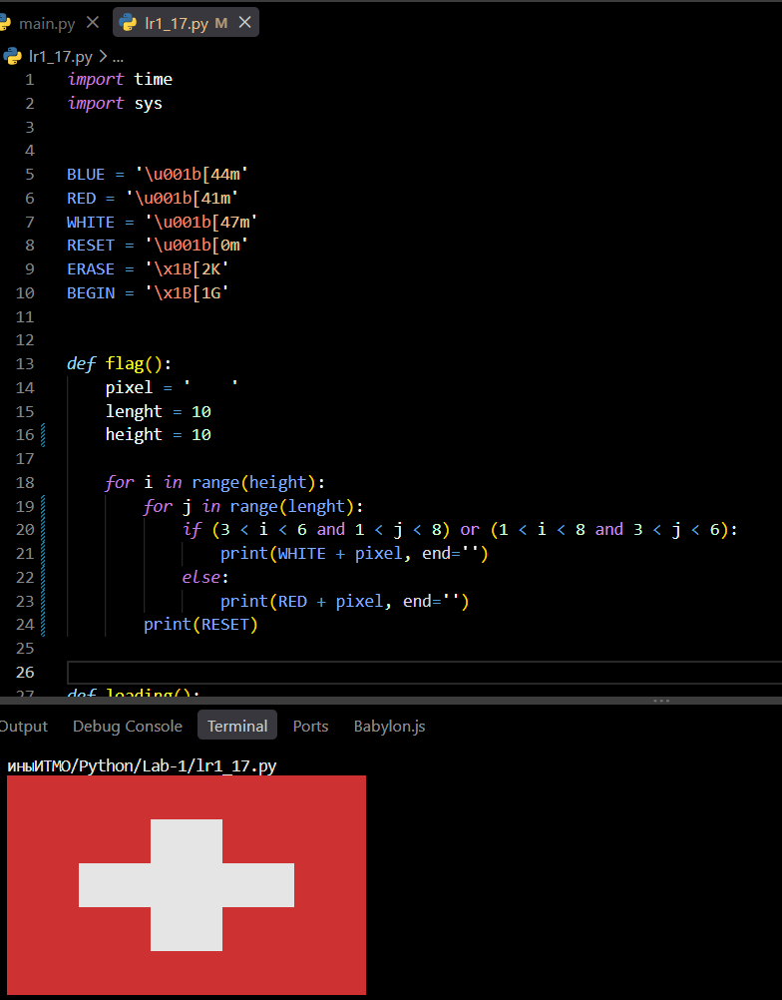
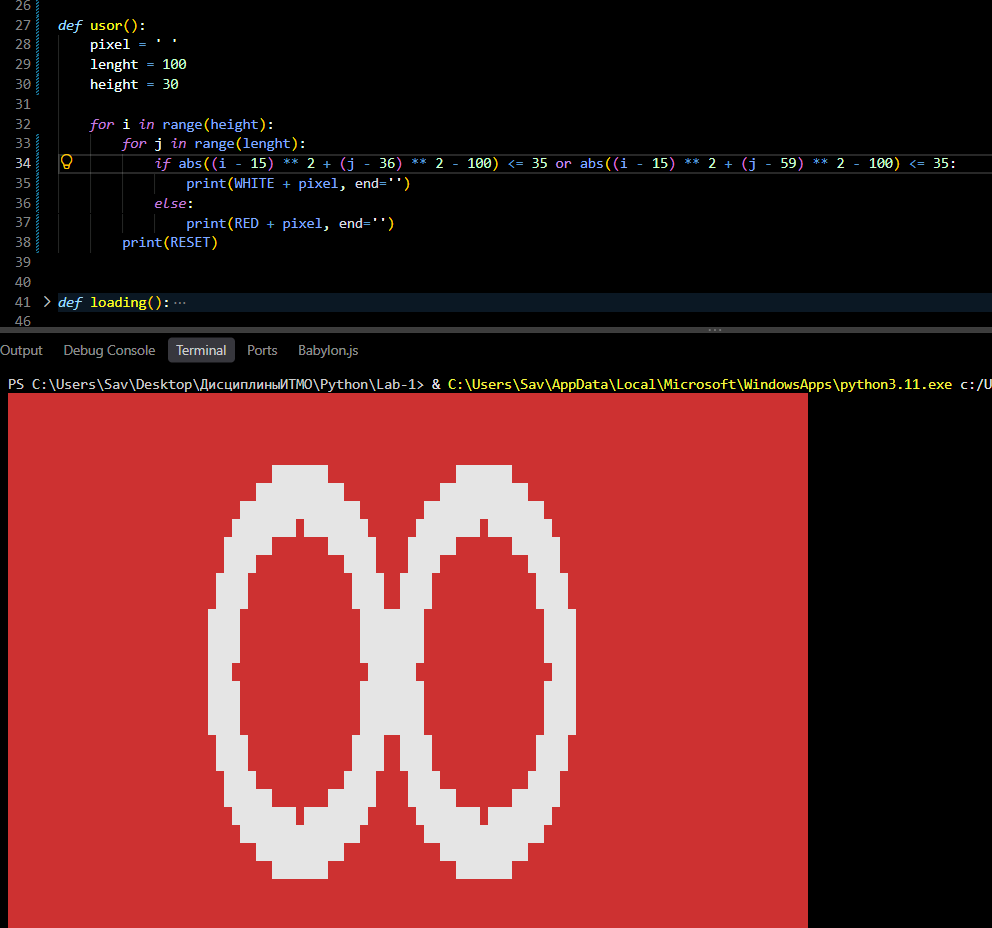
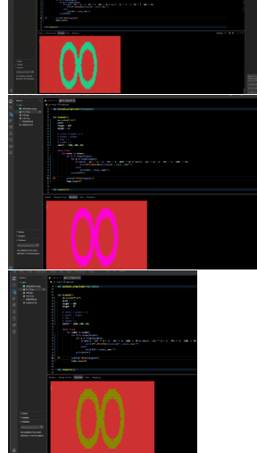
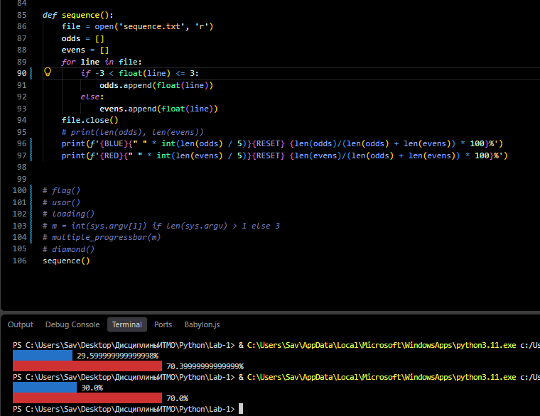
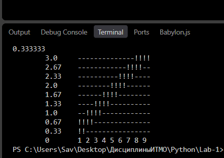

# Lab-1
## Лабораторная работа №1


**Вариант**

| Вариант | Страна | Узор | Функция | Условие |
| 10 | Швейцария | j | y = x / 3 | Числа от -3 до 3 и остальные |

**Задание**

* Сгенерировать при помощи escape-символов в консоли изображение флага, соответственно варианту (столбец "Страна").

<p align="center">
  
</p>

* Сгенерировать в консоли повторяющийся узор (столбец "Узор").

<p align="center">
  
</p>

* Используя функцию очищения консольного вывода (```os.system("cls")``` или ```os.system("clear")```, а также последовательности управления курсором, реализовать анимацию из 3-4 кадров.

<p align="center">
  
</p>

* Используя прилагаемый файл с числовой последовательностью ```sequence.txt```, вывести диаграмму процентного соотношения двух чисел (количество в группе или сумма) согласно варианту, исходя из того, что сумма этих двух чисел равна 100%.

<p align="center">
  
</p>

**Допзадание**

Сгенерировать (**не** вывести построчно) в консоли первую четверть графика функции при помощи escape-символов, минимум 9 строк в высоту (столбец "Функция").

<p align="center">
  
</p>